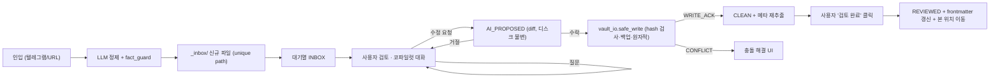

# 10. 정보처리 파이프라인 무결성 수정 명세 (Pipeline Integrity Fix Spec)

> 작성: 2026-10-07 · 근거: 54차 감사 (`00_PROJECT_LOG.md`) · 대상 코드: `daemon/event_bridge.py`, `daemon/agent_core.py`, `dashboard_prototype.html`
> 라인 번호는 2026-10-07 10:39 기준 루트 사본 기준. 수정 진행 시 어긋날 수 있음.

---

## 0. 한 문장 진단

**"AI가 출력한 것 = 확정 = 디스크 덮어쓰기"** 로 인식·확인·확정·저장·후속 5단계가 하나로 붕괴되어 있다.
그 결과 (1) 사용자가 승인하지 않은 내용이 볼트에 쓰이고, (2) 쓰인 내용은 되돌릴 수 없으며, (3) 화면은 실제와 다른 상태를 보여준다.

이 시스템의 볼트는 **구직용 경험·성과 기록**이다. 여기서 잘못된 숫자 하나는 자소서·면접에서 그대로 사실 오류가 된다. 따라서 이 문서의 최상위 불변식은 다음과 같다.

### 최상위 불변식 (Invariants)

| ID | 불변식 |
|---|---|
| **INV-1** | 볼트 파일은 **사용자의 명시적 행위(수락/저장)** 없이는 절대 변경되지 않는다. 단, 신규 파일 생성(인입)은 예외로 하되 기존 파일을 덮어쓰지 않는다. |
| **INV-2** | 모든 쓰기 직전 이전 버전이 백업되며, 사용자는 언제든 이전 버전으로 복원할 수 있다. |
| **INV-3** | 화면의 "저장됨"은 **서버가 디스크 쓰기 성공을 확인한 뒤에만** 표시된다. |
| **INV-4** | 볼트 디스크 파일이 유일한 진실 원천(SSOT)이다. 캐시(cards_store.json, localStorage)는 디스크보다 우선할 수 없다. |
| **INV-5** | 시스템은 원문(raw)에 없는 수치·고유명사·날짜를 **스스로 만들어 내지 않는다**. 생성된 경우 반드시 "미검증"으로 표시된다. |
| **INV-6** | 검증 점수·체크리스트는 실제 검사 결과만 반영한다. 강제로 통과/100점 처리하지 않는다. |

---

## 1. 이슈 목록 (요약표)

심각도: 🔴 Critical(데이터 손실·사실 왜곡) / 🟠 High(허위 상태·불일치) / 🟡 Medium(품질·후속) / ⚪ Low

| ID | 단계 | 심각도 | 제목 |
|---|---|---|---|
| F-01 | 인입·저장 | 🔴 | 인입 시 LLM이 정한 파일명으로 기존 파일을 존재 확인 없이 덮어씀 |
| F-02 | 후속 | 🔴 | `rollback_note`가 파일을 삭제 → F-01과 결합 시 사용자 원본 영구 소실 |
| F-03 | 확인 | 🔴 | 프론트 Auto-Fix·오프라인 시뮬레이션에 **하드코딩된 성과 수치**가 본문에 주입됨 |
| F-04 | 인식 | 🔴 | 코파일럿 질문/수정 판정을 LLM `is_modification`에 일임 → 질문에도 디스크 쓰기 |
| F-05 | 확인 | 🔴 | AI 수정안이 diff·승인 없이 즉시 볼트에 기록됨 |
| F-06 | 저장 | 🔴 | 백업·버전 관리 없음, 비원자적 쓰기 |
| F-07 | 인식 | 🔴 | LLM 생성 수치의 출처 검증 없음 (원문에 없는 숫자 생성 가능) |
| F-08 | 저장 | 🟠 | 디스크·cards_store.json·localStorage 3중 진실원천, 충돌 검사 없음 |
| F-09 | 확정 | 🟠 | 서버 ack 전 "저장 완료" 표시 / 쓰기 실패 시 에러 미통지 |
| F-10 | 확정 | 🟠 | WS 단절 시 로컬 시뮬레이션이 "볼트에 저장됨"이라고 허위 안내 + 본문 재생성으로 사용자 편집 소실 |
| F-11 | 확인 | 🟠 | Auto-Fix·⌘S 저장 시 체크리스트 passed=True, score=100 강제 |
| F-12 | 확정 | 🟠 | `COMMITTED` 하나에 AI수정/저장/자동교정/트리아지완료가 혼재 |
| F-13 | 확정 | 🟠 | 파일 frontmatter `status`와 앱 상태 불일치 |
| F-14 | 인입 | 🟠 | "검토 대기(REVIEW_STAGED)"인데도 인입 즉시 볼트에 파일이 쓰임 |
| F-15 | 저장 | 🟠 | `COMMIT_CARD`가 본문이 비면 스텁 템플릿으로 기존 파일 덮어씀 |
| F-16 | 후속 | 🟡 | AI 수정 후 태그·위키링크·MOC·synthesis·트리아지 다이제스트 재추출 안 됨 |
| F-17 | 후속 | 🟡 | `APPROVE_INSIGHT`가 `"## 🔗"` 문자열 전역 치환 → 다중 삽입·구조 훼손 |
| F-18 | 후속 | 🟡 | Undo / 버전 복원 UI 없음 |
| F-19 | 저장 | 🟡 | 파일명 경로 검증 없음 (`../`, 절대경로, 금지문자) |
| F-20 | 보안 | 🟡 | httpx INFO 로그에 텔레그램 봇 토큰 평문 기록 |
| F-21 | 인식 | ⚪ | 코파일럿 대화 이력 최근 6턴만 전달, 긴 문서 컨텍스트 한도 미관리 |
| F-22 | 검증체계 | ⚪ | 테스트가 실제 볼트에 쓰기 수행 (테스트용 샌드박스 볼트 없음) |

---

## 2. 이슈 상세 및 수정 방법

### F-01 🔴 인입 시 기존 파일 무단 덮어쓰기
- **근거**: `agent_core.py:315-322` 파일명을 LLM 출력(`gen_data["filename"]`)에서 받고 stem을 15자로 절단. `agent_core.py:528-529` 존재 여부 확인 없이 `write_text`.
- **시나리오**: 볼트에 이미 `경험_넥스트러너스_AI커리큘럼.md`(17KB, 수작업)가 있는데 LLM이 같은 이름을 제안 → 원본이 새 노트로 교체됨. 15자 절단 때문에 서로 다른 제목이 같은 파일명으로 수렴할 확률도 높음.
- **수정**:
  1. 파일명 생성 후 `vault_io.resolve_unique_path(name)` 통과 필수. 존재하면 `_2`, `_3` 접미사 부여.
  2. 15자 절단 제거 → 최대 길이는 60자로, 절단 시 뒤에 짧은 해시(`_a3f9`) 부착.
  3. 같은 주제 기존 파일이 감지되면 덮어쓰지 말고 카드에 `merge_candidate: <기존파일>` 표시 → 사용자가 "병합/별도 저장" 선택.
- **수용 기준**: 기존 파일명과 동일한 제안이 와도 기존 파일 바이트가 변하지 않는다(테스트로 해시 비교).

### F-02 🔴 rollback이 파일 삭제
- **근거**: `agent_core.py:627-633` `target_path.unlink()`. 텔레그램 봇 `telegram_bot.py:119`에서 호출.
- **수정**: rollback은 "이번 인입이 만든 파일"에 대해서만 동작. 인입 시 `created_by_task: <task_id>`와 생성 전 존재 여부를 기록하고,
  - 신규 생성 파일 → `_archive/rolled_back/`로 이동(삭제 금지),
  - 기존 파일을 수정한 경우 → 백업본(F-06)으로 복원.
- **수용 기준**: rollback 후에도 사용자의 원본 파일은 남아 있고, 롤백된 파일은 `_archive`에서 찾을 수 있다.

### F-03 🔴 하드코딩된 성과 수치 주입
- **근거**:
  - `dashboard_prototype.html` `applyAutoFix()` (≈4494~): `DOC-2609-04`의 "패키지 전환 성과 미검증"을 **"런칭 3주 만에 수강생 142명 모집 및 유료 전환율 24.8% 달성 (수익 1,840만 원)"** 으로 치환. `DOC-2609-01`도 고정 문장으로 치환.
  - `simulateLocalCopilotExecution()` (≈4456~): "완수율 92%, 유료 전환율 24.8%" 등 고정 응답 + `card.status='COMMITTED'`.
  - 이 결과가 `APPLY_AUTO_FIX` → `event_bridge.py:359-367`로 디스크에 기록됨.
- **왜 치명적인가**: 프로토타입 데모용 문자열이 **실제 경험 파일**에 들어간다. 사용자가 모르는 사이 이력서 근거 문서에 지어낸 숫자가 박힌다.
- **수정**:
  1. 하드코딩 치환 로직 **전부 삭제**. 데모 데이터는 `defaultCards` 표시 전용으로만 두고 디스크 경로와 분리(`card.is_demo=true`면 디스크 쓰기 금지).
  2. Auto-Fix는 "수정안 생성(F-05 PROPOSE)"으로만 동작. 수치가 필요한 보완은 **자동으로 채우지 말고** `[[수치 입력 필요: 전환율]]` 같은 플레이스홀더 + 사용자 입력 요청.
  3. 이미 오염됐을 수 있는 파일 점검: 볼트 전체에서 `142명|24.8%|1,840만` grep → 사용자에게 목록 보고.
- **수용 기준**: 코드베이스에 특정 카드 ID별 본문 치환 문자열이 0건. 수치 보완은 항상 사용자 입력을 거친다.

### F-04 🔴 질문인데 파일이 수정됨
- **근거**: `event_bridge.py:283` `is_modification = parsed.get(...)`만으로 쓰기 분기. 실제로 09:58 질문 프롬프트에 `메모_CJ올리브네트웍스채용.md` 덮어쓰기 발생.
- **수정**: 의도 판정을 LLM 단독 결정에서 **2중 게이트**로.
  1. 1차(규칙): 프롬프트에 수정 동사(`바꿔|고쳐|수정|추가|반영|보강|삭제|다시 써|정리해`)가 없고 의문형(`?`, `뭐야`, `왜`, `어떻게`)이면 → `ask` 확정, 모델은 답변만.
  2. 2차(모델): 수정 의도로 보이면 모델이 `proposed_markdown` 생성.
  3. **그리고 어떤 경우에도 디스크에는 쓰지 않는다** — F-05의 수락 단계로 넘김. 판정이 틀려도 피해가 "불필요한 제안 1건"으로 제한됨.
- **수용 기준**: 판정 오류가 나도 디스크 파일 mtime이 변하지 않는다.

### F-05 🔴 승인 없는 AI 즉시 기록
- **근거**: `event_bridge.py:293-322` 판정 즉시 `target_file.write_text`, `CARD_COMMITTED` 브로드캐스트. 프론트 `COPILOT_RESULT`(≈4723~)가 `status='COMMITTED'` 처리.
- **수정 (핵심 설계)**: "제안 → 검토 → 수락" 3단계 프로토콜.
  ```
  [Client] EXECUTE_COPILOT {task_id, prompt, base_hash}
  [Server] COPILOT_RESULT  {assistant_response, intent: "ask"|"edit",
                            proposal_id?, proposed_markdown?, base_hash}
           ※ 디스크 쓰기 없음. proposal은 메모리/임시파일(.subrain/proposals/)에만.
  [Client] 좌측 문서 영역에 diff 표시 (채팅창에는 대화만 — 사용자 요구 유지)
           [수락] [부분 수락(섹션별)] [거절] [에디터로 가져와서 고치기]
  [Client] APPLY_PROPOSAL {proposal_id, final_markdown, base_hash}
  [Server] vault_io.safe_write(...) → WRITE_ACK {ok, new_hash, backup_id} | WRITE_ERROR
  ```
  - diff는 **문서 영역**에 인라인(추가 초록/삭제 빨강 줄 단위)으로 띄운다. 52차의 "채팅에 변경 기록 남기지 말 것" 요구와 충돌하지 않음.
  - 수락 전까지 카드 상태는 `AI_PROPOSED`(F-12).
- **수용 기준**: `EXECUTE_COPILOT` 처리 경로에 `write_text` 호출이 존재하지 않는다. 수락 클릭 전 볼트 파일 불변.

### F-06 🔴 백업 없음 / 비원자적 쓰기
- **근거**: `event_bridge.py:134, 167, 311, 366, 452`, `agent_core.py:529, 620, 731` 모두 직접 `write_text`. 볼트는 git 저장소 아님.
- **수정**: 신규 모듈 `daemon/vault_io.py`로 **모든 디스크 쓰기를 단일화**.
  ```python
  def safe_write(rel_path: str, content: str, expected_hash: str | None,
                 reason: str, actor: str) -> WriteResult:
      path = resolve_in_vault(rel_path)            # F-19 경로 검증
      if path.exists():
          cur = path.read_bytes()
          if expected_hash and sha256(cur) != expected_hash:
              raise ConflictError(current_hash=sha256(cur))   # F-08
          backup_id = backup(path, cur)            # VAULT/.subrain_history/<stem>/<ts>.md
      tmp = path.with_suffix(".md.tmp")
      tmp.write_text(content, "utf-8"); os.fsync(...)
      os.replace(tmp, path)                        # 원자적 교체
      journal.append({ts, rel_path, actor, reason, backup_id, new_hash})
      return WriteResult(ok=True, new_hash=..., backup_id=...)
  ```
  - 백업 위치: `VAULT_DIR/.subrain_history/` (옵시디언에서 숨김 폴더라 그래프 오염 없음). 파일당 최근 30개 보존.
  - 저널: `daemon/write_journal.jsonl` — 누가(사용자/코파일럿/인입/인사이트) 언제 왜 썼는지.
  - **최초 1회**: 수정 착수 전 볼트 전체 스냅샷 `.subrain_history/_snapshot_YYYYMMDD.tar.gz` 생성.
- **수용 기준**: 코드베이스에서 `vault_io.py` 외 `write_text`/`unlink` 호출 0건(grep으로 확인). 모든 쓰기에 backup_id가 있다.

### F-07 🔴 생성 수치 출처 미검증
- **근거**: 인입(`process_intake`)·코파일럿·Auto-Fix 모두 LLM이 생성한 숫자를 그대로 저장. 예: `경험_프리랜서_AI러닝패키지.md:28` "완성률 92%, NPS 89점" — 원문 출처 확인 불가.
- **수정**: `fact_guard.py` 후처리.
  1. 생성 본문에서 수치 토큰(`\d+(\.\d+)?\s*(%|명|원|만 원|배|점|주|개월)`, 연도) 추출.
  2. 원문(raw archive `> [!QUOTE]` 블록 + 사용자 프롬프트 + 기존 본문)에 같은 값이 있으면 `verified`, 없으면 `unverified`.
  3. `unverified` 수치가 있으면: diff 화면에서 노란 하이라이트 + "원문에 없는 수치 N개" 경고. 수락 시 본문에 `==24.8%==`^미검증 같은 표시 대신, frontmatter `unverified_figures: [...]`로 기록(본문 오염 최소화).
  4. 수치 충돌(같은 지표에 다른 값, 예: 40% vs 70% 시작) 감지 시 **시스템이 한쪽을 고르거나 "단계적 상승"으로 봉합하지 않는다.** 두 값과 출처를 나란히 보여주고 사용자가 결정.
- **수용 기준**: 원문에 없는 수치를 포함한 제안은 항상 경고와 함께 표시된다.

### F-08 🟠 3중 진실원천 / 충돌 미검사
- **근거**: `dashboard_prototype.html:2440-2475` localStorage(`subrain_cards_v9`)를 먼저 로드, `SYSTEM_CONNECTED`(≈4685) 서버 카드와 얕은 병합. 서버는 `cards_store.json`의 `markdown_content` 보관. 디스크 파일은 직접 읽지 않음.
- **시나리오**: 옵시디언에서 파일 수정 → 대시보드는 캐시된 옛 본문 표시 → ⌘S → 옵시디언 수정분 소실.
- **수정**:
  1. `cards_store.json`에서 `markdown_content` 필드 제거. 카드는 메타데이터(상태·경고·채팅 이력)만 보관, 본문은 **항상 디스크에서 읽어 전달**(`content`, `content_hash`, `mtime`).
  2. localStorage는 UI 설정·채팅 초안만. 카드 본문 캐시 금지.
  3. 모든 쓰기 요청에 `base_hash` 포함 → 불일치면 `WRITE_CONFLICT` 응답 → 프론트는 "디스크 버전이 바뀌었습니다: [디스크 버전 보기] [내 버전으로 덮어쓰기(백업됨)] [3-way diff]".
  4. (선택) `watchdog`으로 볼트 변경 감시 → `FILE_CHANGED_ON_DISK` 브로드캐스트 → 열려 있는 카드 갱신 배너.
- **수용 기준**: 옵시디언에서 수정한 뒤 대시보드에서 저장 시도하면 덮어쓰지 않고 충돌 안내가 뜬다.

### F-09 🟠 ack 전 성공 표시 / 실패 미통지
- **근거**: `commitActiveCard()` (≈4175-4234) 4189~4220에서 "Saved to Vault ✓"·토스트 후 4222에서 전송. `saveActiveCardToDisk()` 4172도 동일. 서버 `COMMIT_CARD`·`SAVE_CARD_CONTENT`는 쓰기 예외를 잡지 않아 클라이언트에 아무것도 안 감.
- **수정**:
  1. 클릭 시 상태는 `SAVING…`(스피너)만. `WRITE_ACK` 수신 후 `Saved`, `WRITE_ERROR`/`WRITE_CONFLICT`/5초 타임아웃이면 빨간 상태 + 재시도 버튼.
  2. 요청마다 `request_id` 부여, 응답 매칭.
  3. 서버 모든 쓰기 핸들러를 `try/except` → `WRITE_ERROR {request_id, error}`.
- **수용 기준**: 데몬을 끈 상태에서 저장 클릭 시 "저장됨"이 절대 표시되지 않는다.

### F-10 🟠 오프라인 허위 저장 + 본문 재생성
- **근거**: `sendCopilotMessage()` WS 미연결 시 `simulateLocalCopilotExecution()` 호출 → "옵시디언 볼트에 실시간 저장되었습니다" 응답, `card.markdown_content = generateStandardMarkdown(card)`로 사용자 편집본을 카드 필드 기반 템플릿으로 **덮어씀**.
- **수정**: 시뮬레이션 함수 삭제. 오프라인이면 입력창 비활성 + "데몬 연결 끊김 — 재연결 중" 배너, 입력 내용은 초안으로 보존. 상단 `WS Live` 표시와 연동.
- **수용 기준**: 오프라인 상태에서 본문·상태가 변하지 않는다.

### F-11 🟠 가짜 검증 (강제 100점)
- **근거**: `event_bridge.py:174-176`(저장 시 score=100), `352-357`(Auto-Fix 시 모든 checklist passed=True), 프론트 `applyAutoFix`, `commitActiveCard` 4198-4199.
- **수정**: 저장/교정 후 **critic 재실행**(`critic_validator`)으로 점수·체크리스트 재계산. 비용이 크면 최소한 "재검증 필요" 상태로 두고 점수를 회색 처리. 사용자가 경고를 무시하고 저장하는 것은 허용하되 `warning_acknowledged: true`로 기록하고 경고는 지우지 않는다.
- **수용 기준**: 코드에 `score = 100.0` 하드 대입 0건.

### F-12 🟠 상태 의미 혼재
- **근거**: `COMMITTED`가 코파일럿 수정(`event_bridge.py:298`), 저장(173), Auto-Fix(353), 인입 자동통과(`agent_core.py:519`)에서 모두 설정됨. 대기열 필터는 이 값으로 "처리 대기/완료"를 가름 → AI가 고치면 사용자가 보지도 않은 카드가 대기열에서 사라짐.
- **수정**: 두 축으로 분리.
  - **문서 상태(document)**: `CLEAN`(디스크와 동일) / `DIRTY`(에디터 미저장) / `AI_PROPOSED`(수락 대기 제안 있음) / `SAVING` / `CONFLICT`
  - **검토 상태(review)**: `INBOX`(미검토) / `NEEDS_FIX`(경고) / `REVIEWED`(사용자가 '검토 완료' 명시) / `TOMBSTONE`
  - 대기열은 `review` 축으로만 필터. `REVIEWED`는 **사용자 버튼 클릭으로만** 전이. 저장은 review를 바꾸지 않음.
  - 전이표를 `08_DASHBOARD_DATA_MAPPING_SPEC.md`에 추가.
- **수용 기준**: 코파일럿 수정·저장만으로 카드가 대기열에서 빠지지 않는다.

### F-13 🟠 frontmatter status 불일치
- **근거**: `경험_넥스트러너스_고객불신전환.md` frontmatter `status: 검토대기`인데 앱은 COMMITTED.
- **수정**: review 상태 전이 시 `vault_io.update_frontmatter(path, {"status": ..., "reviewed_at": ...})` — 본문은 건드리지 않고 YAML만 갱신(파서: `python-frontmatter` 또는 최소 정규식). 매핑: INBOX→`검토대기`, NEEDS_FIX→`보완필요`, REVIEWED→`완료`.
- **수용 기준**: 검토 완료 클릭 후 옵시디언에서 status가 `완료`로 보인다.

### F-14 🟠 "검토 대기"인데 이미 볼트에 기록
- **근거**: `agent_core.py:519-529` `final_status`가 `REVIEW_STAGED`여도 `write_text` 실행.
- **결정 필요 (사용자)**:
  - **안 A (권장)**: 검토 전 노트는 `VAULT_DIR/_inbox/`에 생성 → 검토 완료 시 본 위치로 이동. 옵시디언 그래프/검색에 미검토 노트가 섞이지 않음.
  - 안 B: 현 위치 유지하되 frontmatter `status: 검토대기` + 태그 `#inbox`로 구분.
- **수용 기준(안 A)**: 미검토 카드의 파일은 `_inbox/`에만 존재.

### F-15 🟠 COMMIT_CARD 스텁 덮어쓰기
- **근거**: `event_bridge.py:108-131` `markdown_content`가 비면 템플릿 생성 후 134에서 덮어씀.
- **수정**: 본문이 비어 있고 파일이 존재하면 **거부**(`WRITE_ERROR: empty content`). 스텁 생성은 파일이 없을 때만.
- **수용 기준**: 빈 본문 저장 요청으로 기존 파일이 변하지 않는다.

### F-16 🟡 수정 후 파생 데이터 stale
- **근거**: 코파일럿/에디터 저장 후 `tags`, `wikilinks`, `moc`, `synthesis`, 트리아지 다이제스트(`getCardStructuredDigest`)는 카드의 옛 필드를 그대로 사용.
- **수정**: 저장 성공 후 서버에서 `derive_metadata(markdown)` 실행 — frontmatter tags, 본문 `[[...]]`, `## 1. 한 줄 요약` 섹션을 파싱해 카드 메타 재계산 → `CARD_UPDATED` 브로드캐스트. LLM 불필요(정규식).
- **수용 기준**: 본문에서 위키링크를 지우고 저장하면 우측 1-Hop 목록에서도 사라진다.

### F-17 🟡 APPROVE_INSIGHT 전역 치환
- **근거**: `event_bridge.py:448-449` `src_text.replace("## 🔗", ...)` — 해당 문자열이 여러 번 있으면 모두에 삽입, 헤딩 줄 중간에 끼어듦. 대상 파일 존재 확인·백업 없음.
- **수정**: 마크다운 섹션 파서로 첫 `## 🔗` 섹션의 **마지막 줄 뒤**에 항목 추가. 이미 같은 링크가 있으면 스킵(멱등). `vault_io.safe_write` 경유. 양방향이라면 target 파일에도 역링크.
- **수용 기준**: 같은 인사이트를 두 번 승인해도 링크는 1개.

### F-18 🟡 Undo / 복원 UI 없음
- **수정**: F-06 백업을 활용. 문서 헤더에 `⟲ 버전 기록` → 최근 백업 목록(시각·행위자·사유) → 미리보기 diff → [이 버전으로 복원](복원도 safe_write라 다시 백업됨). 저장 직후 토스트에 `[되돌리기]` 10초 노출.
- **수용 기준**: 코파일럿 수락 직후 한 번의 클릭으로 이전 본문 복원.

### F-19 🟡 경로 검증 없음
- **근거**: 모든 핸들러가 `VAULT_DIR / filename` 직접 결합.
- **수정**: `resolve_in_vault(name)` — 금지문자 제거(`\/:*?"<>|`), `..`·절대경로 거부, `path.resolve()`가 `VAULT_DIR.resolve()` 하위인지 확인, `.md` 강제, `.subrain_history`·`_archive` 직접 지정 거부.

### F-20 🟡 봇 토큰 로그 노출
- **근거**: `task-4402.log` httpx INFO 라인에 `api.telegram.org/bot<TOKEN>/getUpdates` 평문.
- **수정**: `main.py` 로깅 설정에 `logging.getLogger("httpx").setLevel(logging.WARNING)`. 기존 로그 파일 삭제. **BotFather에서 토큰 재발급**(이미 노출됨). `.env`가 git에 포함되지 않았는지 확인.

### F-21 ⚪ 컨텍스트 관리
- 대화 이력 6턴 고정, 문서 전문 무제한 삽입. 수정 시 긴 문서는 모델이 섹션을 누락할 위험. → 편집 요청은 **섹션 단위 패치**(`target_section`, `new_section_body`)로 받는 방식을 2단계 개선안으로 검토. 전문 재작성 대비 누락 위험·토큰 비용 모두 감소.

### F-22 ⚪ 테스트가 실제 볼트를 건드림
- 54차 감사 중 브라우저 테스트가 실제 볼트 파일을 수정한 정황. → `VAULT_DIR`를 환경변수로 테스트 샌드박스(`/tmp/subrain_test_vault`, 실제 볼트 복사본)로 바꾸는 `run.sh --test` 모드 추가. 에이전트 검증은 항상 이 모드로만.

---

## 3. 목표 아키텍처 (수정 후 흐름)



### 신규/변경 모듈

| 모듈 | 역할 |
|---|---|
| `daemon/vault_io.py` (신규) | `resolve_in_vault`, `read_note`(content+hash+mtime), `safe_write`, `backup`, `list_versions`, `restore`, `update_frontmatter`, `move_note`. **유일한 디스크 쓰기 지점.** |
| `daemon/fact_guard.py` (신규) | 수치 추출·원문 대조·충돌 감지 |
| `daemon/proposals.py` (신규) | 제안 저장(`.subrain/proposals/<id>.json`), 만료(24h) |
| `daemon/event_bridge.py` | 메시지 프로토콜 교체(§4), 모든 쓰기를 vault_io로 |
| `daemon/agent_core.py` | 인입 경로 `_inbox`, unique path, rollback 안전화, refine_note도 제안 방식 |
| `dashboard_prototype.html` | 상태 2축, diff 뷰, ack 기반 저장, 오프라인 처리, 하드코딩 제거, 버전 기록 UI |

---

## 4. WebSocket 메시지 프로토콜 v2

| 방향 | 타입 | 페이로드 | 비고 |
|---|---|---|---|
| C→S | `OPEN_NOTE` | `task_id` | 서버가 디스크에서 읽어 `NOTE_CONTENT` 응답 |
| S→C | `NOTE_CONTENT` | `task_id, content, hash, mtime` | 본문의 유일한 공급 경로 |
| C→S | `EXECUTE_COPILOT` | `request_id, task_id, prompt, base_hash, history` | 디스크 쓰기 없음 |
| S→C | `COPILOT_RESULT` | `request_id, intent, assistant_response, proposal_id?, proposed_markdown?, fact_report?` | |
| C→S | `APPLY_PROPOSAL` | `request_id, proposal_id, final_markdown, base_hash` | 부분 수락은 final_markdown에 반영 |
| C→S | `SAVE_NOTE` | `request_id, task_id, content, base_hash` | 에디터 ⌘S |
| S→C | `WRITE_ACK` | `request_id, task_id, new_hash, backup_id` | |
| S→C | `WRITE_CONFLICT` | `request_id, disk_hash, disk_content` | |
| S→C | `WRITE_ERROR` | `request_id, error` | |
| C→S | `SET_REVIEW_STATE` | `request_id, task_id, review_state` | frontmatter·이동 동반 |
| C→S | `LIST_VERSIONS` / `RESTORE_VERSION` | `task_id` / `task_id, backup_id, base_hash` | |
| S→C | `FILE_CHANGED_ON_DISK` | `task_id, hash` | watchdog (선택) |

폐기: `COMMIT_CARD`, `SAVE_CARD_CONTENT`, `SYNC_DISK_FILE`, `APPLY_AUTO_FIX`(→ `EXECUTE_COPILOT` 프리셋 프롬프트로 대체).

---

## 5. 실행 계획 (Phase)

각 Phase 끝에 Green 확인 후 커밋(마이크로 체크포인트).

### Phase 0 — 즉시 응급조치 (코드 변경 최소, 30분)
1. 볼트 전체 스냅샷 백업 (`tar`) — **가장 먼저**.
2. 볼트에서 하드코딩 수치(`142명`, `24.8%`, `1,840만`) 및 `> [!NOTE] 🤖 AI Copilot 교정` 잔존 블록 grep → 사용자에게 목록 보고.
3. 10/07 오늘 수정된 4개 파일(`메모_CJ올리브네트웍스채용`, `경험_프리랜서_AI러닝패키지`, `경험_모빅랩_기술학습설득`, `경험_넥스트러너스_고객불신전환`) 사용자 확인 요청.
4. httpx 로그 레벨 조정 + 토큰 재발급 안내 (F-20).
5. 임시 차단: `EXECUTE_COPILOT`의 디스크 쓰기 분기, `applyAutoFix` 하드코딩, `simulateLocalCopilotExecution` 비활성화.

### Phase 1 — 저장 계층 (F-06, F-19, F-15, F-01, F-02, F-09)
- `vault_io.py` 작성 + 단위 테스트(pytest, 임시 디렉터리).
- 모든 `write_text`/`unlink`를 vault_io로 교체. grep 0건 확인.
- 서버 ack/에러 응답, 프론트 SAVING 상태.

### Phase 2 — 제안/수락 (F-04, F-05, F-10, F-03)
- 프로토콜 v2의 COPILOT·PROPOSAL 부분.
- 문서 영역 diff 뷰(줄 단위, 외부 라이브러리 없이 LCS 또는 `diff-match-patch` CDN).
- 오프라인 처리.

### Phase 3 — 진실원천 단일화 (F-08)
- cards_store에서 본문 제거, OPEN_NOTE/NOTE_CONTENT, base_hash 충돌 처리, localStorage 정리(스키마 v10 마이그레이션 시 본문 필드 삭제).

### Phase 4 — 상태 모델 (F-12, F-13, F-14, F-11)
- 2축 상태, 대기열 필터 교체, frontmatter 동기화, `_inbox` (사용자 결정 후), critic 재실행.

### Phase 5 — 사실 무결성·후속 (F-07, F-16, F-17, F-18)
- fact_guard, 메타 재추출, 인사이트 멱등 삽입, 버전 기록 UI.

### Phase 6 — 검증 체계 (F-22, F-21)
- 테스트 샌드박스 볼트 모드, 섹션 패치 방식 검토.

---

## 6. 검증 시나리오 (전 Phase 공통 회귀 테스트)

모두 **샌드박스 볼트**에서 수행.

| # | 시나리오 | 기대 결과 |
|---|---|---|
| T1 | 코파일럿에 "이 문서 핵심이 뭐야?" | 답변만. 파일 mtime 불변 |
| T2 | "한 줄 요약을 더 짧게 바꿔줘" | 문서 영역에 diff, 파일 불변 → 수락 시에만 변경, 백업 1개 생성 |
| T3 | 옵시디언에서 파일 수정 후 대시보드에서 ⌘S | `WRITE_CONFLICT` 안내, 파일 불변 |
| T4 | 데몬 종료 후 저장 클릭 | "저장됨" 미표시, 에러+재시도 |
| T5 | 기존 파일과 같은 이름이 나오는 인입 | `_2` 접미사 신규 파일, 기존 파일 해시 불변 |
| T6 | 인입 직후 텔레그램 rollback | 신규 파일만 `_archive/rolled_back/`로, 기존 파일 무사 |
| T7 | 원문에 없는 수치가 들어간 제안 | 경고 하이라이트 + fact_report |
| T8 | 저장만 하고 '검토 완료'는 안 누름 | 카드가 대기열에 남음 |
| T9 | 검토 완료 클릭 | frontmatter `status: 완료`, (안 A) 본 위치로 이동 |
| T10 | 수락 직후 [되돌리기] | 이전 본문 복원, 복원 자체도 백업됨 |
| T11 | `filename: "../../x.md"` 요청 | 거부 |
| T12 | 같은 인사이트 2회 승인 | 링크 1개 |

---

## 7. 사용자 결정 사항 (2026-10-08 확정)

1. **미검토 노트 격리**: **안 A 확정 (`VAULT_DIR/_inbox/`)**. 대기열 처리 전 생성 파일은 무조건 `_inbox/`에 격리되어 본 볼트 그래프와 검색을 오염시키지 않음. 검토 완료 시 본 볼트 경로로 이동.
2. **백업 위치**: **볼트 내부 숨김 폴더 (`VAULT_DIR/.subrain_history/`) 확정**. 2026-10-08 기준 전체 1차 스냅샷(`_snapshot_20261008_114700.tar.gz`, 146MB) 확보 완료.
3. **볼트 버전 관리**: **Google Drive 보존 방침**. 볼트 디렉토리 git은 적용하지 않음 (대용량 PDF 및 드라이브 동기화 고려).
4. **Critic 검증 비용 제어**: **기본 ON + UI 토글 스위치 제공**. 저장 시 자동 검증을 수행하되, Gemini 무료 티어 할당량 관리를 위해 필요 시 언제든 끌 수 있는 On/Off 토글을 대시보드 및 설정에 구현.
5. **의심/날조 수치 전수 분석 결과**:
   - `applyAutoFix()` 내 `142명`, `24.8%`, `1,840만 원`은 시스템에 하드코딩되었던 가짜 데모 데이터로 판명(코드에서 영구 제거 대상).
   - `경험_프리랜서_AI러닝패키지.md`의 "68명 중 60명 완주, 완수율 88.2%, NPS 89점, 만족도 95점"은 완전한 허위 수치(실제 원본: 17명 중 15명 잔류, 피드백 주 10h->5h).
   - `경험_모빅랩_기술학습설득.md`의 "데이터 추출 요청 65% 감소, 개발팀 12시간 스프린트 시간 확보, 만족도 94점"은 6인 초음파 예지보전 스타트업 맥락을 소프트웨어 개발사로 날조한 허위 수치(실제 원본: 이틀 30시간 기술 압축학습).

