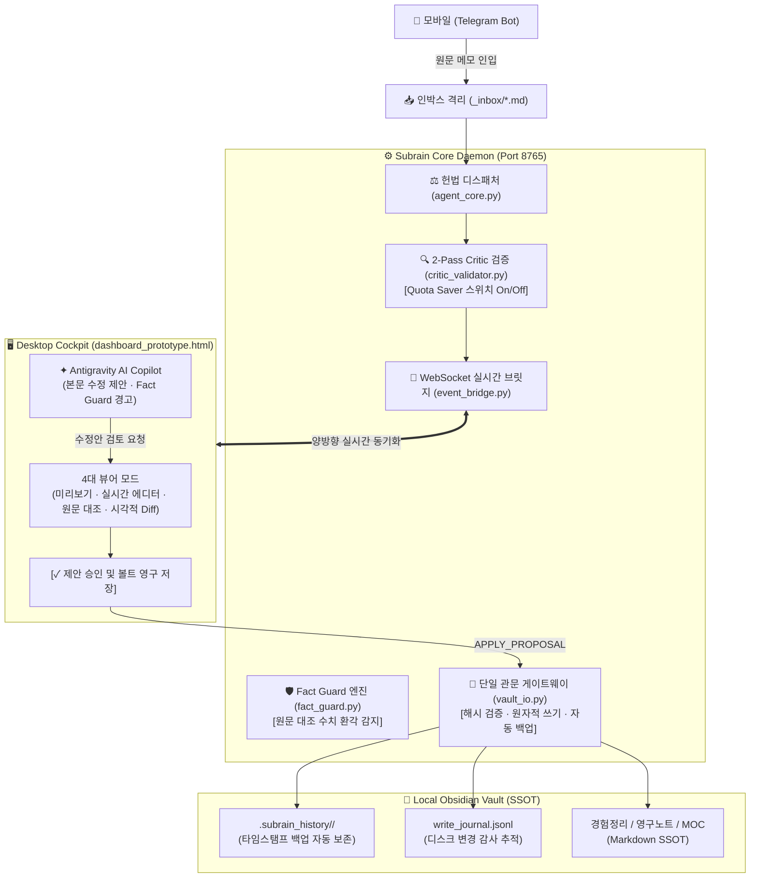

# Subrain_98 (서브레인 98)

> **From Flash of Thought to High-Integrity Personal Knowledge Graph**  
> 찰나의 모바일 착상에서 무결점 로컬 옵시디언 지식 그래프까지

---

## 📌 프로젝트 소개 (Overview)

**Subrain_98**은 일상이나 이동 중에 떠오른 아이디어, 대화, 웹 리서치 결과를 **맥락 손실 제로(Zero-Loss Context)**로 캡처하고, 엄격한 **지식 헌법(Knowledge Constitution)**에 따라 로컬 옵시디언(Obsidian) 볼트로 안전하게 축적·연결하는 **지능형 세컨드 브레인 에이전트 시스템**입니다.

과도한 AI 자율성으로 인한 데이터 오염, 날조 수치(환각), 무단 디스크 덮어쓰기 문제를 근본적으로 차단하기 위해 **5대 무결성 불변식(Integrity Invariants)**과 **단일 관문 파일시스템 아키텍처(vault_io)**를 채택하여, **"AI는 오직 제안만 하고, 디스크 확정은 사용자의 검토(Diff)를 거쳐 단일 관문으로만 수행"**합니다.

---

## 🏛️ 핵심 아키텍처 & 데이터 플로우 (Architecture)



---

## 🛡️ 5대 파이프라인 무결성 불변식 (Invariants)

Subrain_98은 "땜질식 규칙 추가"를 배제하고 자연스러운 단일 데이터 흐름으로 안정성을 보장합니다:

1. **INV-1: 코파일럿 디스크 불변성 (Zero-Disk-Write During Chat)**
   - 대화 및 프롬프트 수정 지시 도중 AI가 로컬 볼트 파일을 절대 무단 덮어쓰지 않습니다. 수정안은 `Proposal` 객체로만 생성됩니다.
2. **INV-2: 단일 관문 및 영구 백업 보장 (Single-Gate & Safe Backup)**
   - 모든 파일시스템 쓰기는 오직 `vault_io.safe_write` 단일 게이트웨이만을 통과합니다. 쓰기 직전 `.subrain_history/`에 원본 백업이 자동 생성되고, 원자적 교체(`.tmp` ➔ `os.replace`)로 파일 깨짐을 원천 방지합니다.
3. **INV-3: 외부 편집 충돌 방어 (Hash Collision Defense)**
   - 사용자가 옵시디언 데스크톱 앱에서 직접 파일을 수정한 경우, 베이스 해시(SHA-256) 불일치를 감지하여 대시보드의 구버전 덮어쓰기를 원천 차단(`WRITE_CONFLICT`)합니다.
4. **INV-4: 인입 격리 (Inbox Isolation)**
   - 텔레그램으로 접수된 검토 전 문서는 볼트 루트가 아닌 `VAULT_DIR/_inbox/`에 격리되어, 기존 완성 노드 덮어쓰기나 지식 그래프 오염을 방지합니다.
5. **INV-5: 사실 무결성 및 수치 환각 차단 (Fact Guard)**
   - AI가 제안한 마크다운 내 모든 정량 수치(`%`, `명`, `원`, `배` 등)를 `> [!QUOTE] 원문 컨텍스트`와 전수 대조하여, 원문에 없는 날조 수치를 실시간 적발·경고합니다.
6. **INV-6: 정직한 상태 머신 (Truthful State Machine)**
   - 백엔드의 `WRITE_ACK`를 수신하기 전까지 화면에 '저장 완료'를 거짓으로 표시하지 않으며, 오프라인 상태를 정직하게 투영합니다.

---

## 🌟 주요 기능 (Key Features)

### 1. 웹 콕핏 대시보드 (`dashboard_prototype.html`)
- **4대 본문 캔버스 뷰 모드**:
  - **모드 1 (Clean Reader)**: 완벽하게 렌더링된 옵시디언 마크다운 뷰어 (위키링크 뱃지 및 메타데이터 지원).
  - **모드 2 (2-Way Live Editor)**: 단축키(`⌘S`) 지원, 로컬 디스크 실시간 양방향 마크다운 에디터.
  - **모드 3 (Compare Mode)**: 단축키(`C`) 지원, 원문 캡처 텍스트와 AI 가공 노트를 좌우 분할하여 일대일 비교.
  - **모드 4 (시각적 Diff 뷰어)**: LCS 기반 줄 단위 비교기. 빨간색(삭제 줄), 초록색(추가 줄) 및 Fact Guard 위반 수치 인라인 `<mark>` 강조.
- **Antigravity AI Copilot 사이드바**:
  - Gemini 3.1 Flash Lite 기반 대화형 어시스턴트 (`⌘K` 포커스).
  - 단순 질의응답과 본문 교정 제안을 지능적으로 분기하여, 사용자가 좌측 캔버스에서 Diff 확인 후 `[제안 승인 및 볼트 영구 저장]` 버튼 클릭 시에만 안전 반영.
- **Critic Quota Saver 스위치**:
  - Gemini 무료 티어 API 할당량 관리를 위해 헤더 스위치로 Critic 자동 재작성 검증을 즉시 On/Off 토글.

### 2. Fact Guard 수치 환각 탐지기 (`daemon/fact_guard.py`)
- 한국어 복합 조사(`에서`, `로`, `를`, `이`, `가`)가 부착된 수치(`850명에서`, `98%로`, `300만 원을`)를 완벽 분리 추출.
- 원문 인용구에 존재하지 않는 임의 수치 발견 시 즉시 `fact_report`를 생성하여 UI에 붉은색 경고 칩 노출.

### 3. 백엔드 에이전트 데몬 (`daemon/`)
- **Telegram Polling Bot**: 텍스트, 링크, 음성 인입 지원.
- **WebSocket EventBridge (`ws://127.0.0.1:8765`)**: 대시보드와 비동기 양방향 통신.
- **Write Journaling (`write_journal.jsonl`)**: 파일 변경 사유, 수정자, 이전 해시, 백업 ID 전수 기록.

---

## 📂 디렉토리 구조 (Directory Structure)

```text
Subrain_98/
├── 00_PROJECT_LOG.md                     # 전체 개발 일지 및 마일스톤 (Milestone 1~57)
├── 01_PRD_PRODUCT_REQUIREMENTS.md          # 제품 요구사항 정의서 (PRD)
├── 02_SYSTEM_ARCHITECTURE.md             # 시스템 아키텍처 명세서
├── 03_BACKEND_PRD.md                     # 백엔드 데몬 세부 사양서
├── 04_WEB_DASHBOARD_SPEC.md              # 웹 콕핏 대시보드 UI/UX 명세서
├── 05_ADVANCED_AGENT_ENGINEERING_BLUEPRINT.md # 에이전트 엔지니어링 청사진
├── 06_TEN_STAGE_SYSTEM_MILESTONES.md     # 10단계 시스템 구축 로드맵
├── 07_STAGE_TASKS_AND_ACTION_PLAN.md     # 단계별 실행 태스크
├── 08_DASHBOARD_DATA_MAPPING_SPEC.md     # 대시보드 데이터 바인딩 규격서
├── 09_FUNCTIONAL_DEVELOPMENT_PLAN.md     # 기능 개발 및 인터랙션 계획서
├── 10_PIPELINE_INTEGRITY_FIX_SPEC.md     # 파이프라인 무결성 개혁 명세서 (INV-1~6, T1~T12)
├── GEMINI.md                             # 워크스페이스 헌법 및 개발 가이드라인
├── dashboard_prototype.html              # 단일 파일 인터랙티브 웹 콕핏 대시보드
├── daemon/                               # 백엔드 에이전트 데몬
│   ├── main.py                           # 데몬 메인 엔트리포인트 (Telegram + WebSocket)
│   ├── agent_core.py                     # 지식 헌법 디스패처 및 파이프라인 엔진
│   ├── event_bridge.py                   # WebSocket 실시간 이벤트 중계기 (INV 준수)
│   ├── vault_io.py                       # [단일 관문] 파일시스템 안전 쓰기/백업/충돌방어
│   ├── fact_guard.py                     # [단일 관문] 원문 대조 수치 환각 탐지기
│   ├── critic_validator.py               # 2-Pass Critic 검증기 (Quota On/Off 지원)
│   ├── telegram_bot.py                   # 텔레그램 인입 인터페이스
│   ├── vault_indexer.py                  # 로컬 볼트 인덱싱 및 관계 분석
│   ├── models.py                         # Pydantic 데이터 모델
│   ├── config.py                         # 환경 설정 로더
│   └── pyproject.toml                    # Python 프로젝트 및 의존성 설정
└── README.md                             # 프로젝트 문서 (본 파일)
```

---

## 🚀 빠른 시작 (Quick Start)

### 1. 환경 설정
`daemon/` 디렉토리에 `.env` 파일을 생성하고 필수 키를 입력합니다.

```bash
cd daemon
cp .env.example .env
```

`.env` 설정 예시:
```env
TELEGRAM_BOT_TOKEN="your_telegram_bot_token"
GEMINI_API_KEY="your_gemini_api_key"
VAULT_DIR="/Users/yourname/Desktop/ObsidianVault"
```

### 2. 백엔드 데몬 실행
Python 3.11+ 및 가상환경을 사용하여 데몬을 가동합니다.

```bash
# 가상환경 패키지 설치
uv sync

# 데몬 실행 (Telegram Polling + WebSocket ws://127.0.0.1:8765)
uv run python main.py
```

### 3. 웹 콕핏 대시보드 열기
별도의 웹 서버 설치 없이 브라우저로 직접 엽니다:
```bash
open dashboard_prototype.html
```

---

## 📜 변경 기록 (Recent Milestones)

- **[Milestone 57]**: 좌측 본문 캔버스 '시각적 Diff 뷰어' (LCS 줄단위 diff) 및 원문 대조 'Fact Guard' 수치 환각 탐지 엔진 구축.
- **[Milestone 56]**: 파이프라인 무결성 5대 불변식(`INV-1`~`INV-6`) 확립 및 `vault_io.py` 단일 관문 게이트웨이 아키텍처 전면 개편.
- **[Milestone 55]**: 볼트 무결성 감사, 볼트 전체 스냅샷(`.subrain_history/`) 생성 및 하드코딩 날조 수치 전수 감사·제거.
- **[Milestone 54]**: 정보처리 파이프라인(인식→확인→확정→저장→후속) 전면 감사 및 `10_PIPELINE_INTEGRITY_FIX_SPEC.md` 수립.
- **[Milestone 53]**: Gemini 3.1 Flash Lite 기반 Antigravity AI Copilot 인터랙티브 챗 패널 탑재.

---

## 📄 라이선스 (License)

Private & Proprietary. All rights reserved by `leejy9`.
