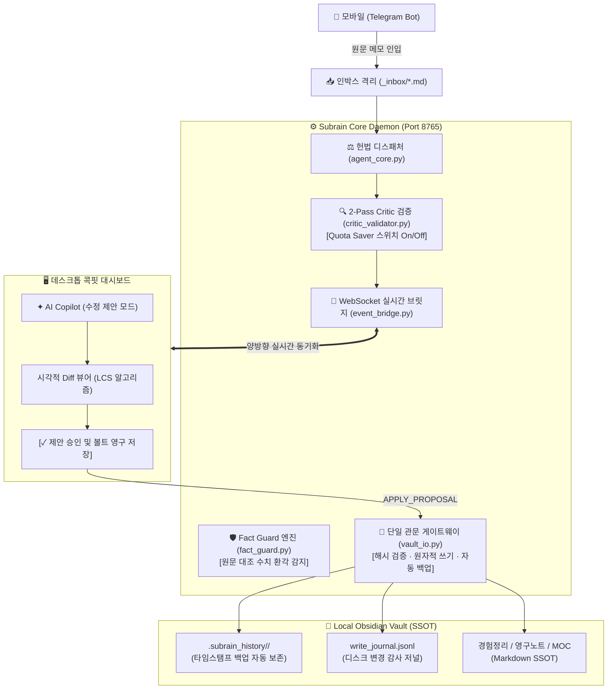

# Subrain_98 (서브레인 98)

> **내 노하우를 맥락째 저장하고, 어떤 AI에 연결해도 다시 설명할 필요 없게 만드는 개인 지식 DB 서비스**

---

## 📌 프로젝트 소개 (Overview)

**Subrain_98**은 일상이나 업무 중 파편화되기 쉬운 경험, 노하우, 웹 리서치 결과를 **맥락 손실 제로(Zero-Loss Context)**로 캡처하여, 엄격한 **지식 헌법(Knowledge Constitution)**에 따라 로컬 옵시디언(Obsidian) 지식 베이스로 구조화하는 **개인 지식 DB 에이전트 시스템**입니다.

과도한 AI 자율성으로 인한 데이터 오염, 날조 수치(환각), 무단 디스크 덮어쓰기 문제를 근본적으로 차단하기 위해 **5대 무결성 불변식(Integrity Invariants)**과 **단일 관문 파일시스템 아키텍처(vault_io)**를 적용하여, **"AI는 오직 제안만 하고, 데이터 확정은 사용자의 시각적 검증(Diff)을 거쳐 단일 관문으로만 수행"**합니다.

---

## 🔄 현재 동작 파이프라인 (Current Pipeline)

```text
[1. 텔레그램 입력] ──> [2. 인박스 격리 (_inbox/)] ──> [3. 헌법·모듈 기반 구조화]
                                                               │
                                                               ▼
[6. 구글 드라이브 동기화] <── [5. 옵시디언 영구 저장] <── [4. 85점 검수 & 개선안 검토]
```

1. **텔레그램 입력**: 모바일에서 원클릭으로 텍스트, 음성, 아티클 링크를 전송.
2. **인박스 격리 (`_inbox/`)**: 미검토 메모가 기존 완성 노드나 지식 그래프를 오염시키지 않도록 임시 폴더에 격리.
3. **헌법·모듈 기반 구조화**: 영구지식(CCIA), 경험정리(STAR), 단순기록(Fleeting) 3대 모듈로 자동 분류.
4. **85점 검수 & 개선안 검토 (2-Pass Critic & Fact Guard)**:
   - 최소 85점 미달 시 자동 교정 루프 실행.
   - **Fact Guard**: 원문 인용구(`> [!QUOTE]`)와 대조하여 AI가 지어낸 가짜 숫자·지표를 실시간 감지 및 경고.
   - **시각적 Diff 뷰어**: 사용자가 변경 전(빨간 줄)과 변경 후(초록 줄)를 직접 확인.
5. **단일 관문 옵시디언 저장 (`vault_io`)**: 사용자가 승인한 시점에만 자동 백업(`.subrain_history/`) 생성 및 원자적(Atomic) 디스크 저장.
6. **클라우드 보존**: 로컬 옵시디언 볼트를 Google Drive로 안전하게 동기화.

---

## 🏛️ 시스템 아키텍처 (Architecture)



---

## 🛡️ 5대 파이프라인 무결성 불변식 (Invariants)

- **INV-1 (디스크 불변성)**: 코파일럿 대화 중에는 디스크 쓰기를 0바이트도 수행하지 않음. 수정안은 `Proposal` 객체로만 생성.
- **INV-2 (단일 관문 및 백업)**: 모든 파일 쓰기는 오직 `vault_io.safe_write`만 통과. 변경 직전 `.subrain_history/` 자동 백업 및 원자적 교체(`.tmp` ➔ `os.replace`).
- **INV-3 (외부 편집 충돌 방어)**: 옵시디언 데스크톱 앱에서 직접 수정한 경우, SHA-256 베이스 해시 불일치를 감지하여 덮어쓰기 원천 차단(`WRITE_CONFLICT`).
- **INV-4 (인입 격리)**: 텔레그램 인입 파일은 `VAULT_DIR/_inbox/`에만 단독 격리되어 볼트 루트 오염 방지.
- **INV-5 (수치 환각 차단 - Fact Guard)**: 원문 인용구에 없는 정량 수치(`%`, `명`, `원`, `배` 등)는 한국어 조사 분리 토크나이저로 실시간 전수 적발.
- **INV-6 (정직한 상태 머신)**: 백엔드의 `WRITE_ACK` 수신 전까지 '저장됨' 허위 표시 금지, 오프라인 상태 정직 투영.

---

## 📂 디렉토리 구조 (Directory Structure)

```text
Subrain_98/
├── 01_PRD_PRODUCT_REQUIREMENTS.md          # 제품 요구사항 정의서 (PRD)
├── 02_SYSTEM_ARCHITECTURE.md             # 시스템 아키텍처 명세서
├── 03_BACKEND_PRD.md                     # 백엔드 데몬 세부 사양서
├── 04_WEB_DASHBOARD_SPEC.md              # 웹 콕핏 대시보드 UI/UX 명세서
├── 05_ADVANCED_AGENT_ENGINEERING_BLUEPRINT.md # 에이전트 엔지니어링 청사진
├── 06_TEN_STAGE_SYSTEM_MILESTONES.md     # 10단계 시스템 구축 로드맵
├── 07_STAGE_TASKS_AND_ACTION_PLAN.md     # 단계별 실행 태스크
├── 08_DASHBOARD_DATA_MAPPING_SPEC.md     # 대시보드 데이터 바인딩 규격서
├── 09_FUNCTIONAL_DEVELOPMENT_PLAN.md     # 기능 개발 및 인터랙션 계획서
├── 10_PIPELINE_INTEGRITY_FIX_SPEC.md     # 파이프라인 무결성 개혁 명세서 (INV-1~6, T1~T12)
├── GEMINI.md                             # 워크스페이스 헌법 및 개발 가이드라인
├── docs/                                 # 공개 문서 및 이미지
│   ├── DEV_LOG_SUMMARY.md                # 주요 설계 의사결정 및 문제 해결 사례 요약
│   └── images/                           # 시스템 스크린샷
├── samples/                              # 바로 실행 가능한 공개 샘플 데이터
│   ├── vault/                            # 샘플 옵시디언 볼트 (00_헌법.md 및 3대 모듈 샘플)
│   └── cards_store.sample.json           # 샘플 카드 데이터셋
├── daemon/                               # 백엔드 에이전트 데몬
│   ├── main.py                           # 데몬 메인 엔트리포인트 (Telegram + WebSocket)
│   ├── agent_core.py                     # 지식 헌법 디스패처 및 파이프라인 엔진
│   ├── event_bridge.py                   # WebSocket 실시간 이벤트 중계기 (INV 준수)
│   ├── vault_io.py                       # [단일 관문] 파일시스템 안전 쓰기/백업/충돌방어
│   ├── fact_guard.py                     # [단일 관문] 원문 대조 수치 환각 탐지기
│   ├── critic_validator.py               # 2-Pass Critic 검증기 (Quota Saver 지원)
│   ├── telegram_bot.py                   # 텔레그램 인입 인터페이스
│   ├── vault_indexer.py                  # 로컬 볼트 인덱싱 및 관계 분석
│   ├── models.py                         # Pydantic 데이터 모델
│   ├── config.py                         # 환경 설정 로더
│   ├── .env.example                      # 환경 변수 설정 템플릿
│   └── pyproject.toml                    # Python 프로젝트 및 의존성 설정
└── README.md                             # 프로젝트 문서 (본 파일)
```

---

## 🚀 빠른 시작 (Quick Start)

저장소를 클론한 후 동봉된 `samples/vault` 샘플 환경을 통해 즉시 테스트할 수 있습니다.

### 1. 환경 설정
`daemon/` 디렉토리로 이동하여 `.env` 파일을 생성합니다.

```bash
cd daemon
cp .env.example .env
```

`daemon/.env` 파일 설정:
```env
TELEGRAM_BOT_TOKEN="your_telegram_bot_token"
GEMINI_API_KEY="your_gemini_api_key"

# 동봉된 샘플 볼트 경로로 바로 실행
VAULT_DIR="./samples/vault"
CONSTITUTION_FILE="./samples/vault/00_헌법.md"
```

### 2. 패키지 설치 및 실행
```bash
# 의존성 패키지 동기화
uv sync

# 데몬 실행 (Telegram Polling + WebSocket ws://127.0.0.1:8765)
uv run python main.py
```

---

## 🗺️ 로드맵 (Roadmap)

- [ ] **웹 서비스형 전환**: 사용자 회원가입 및 개인 Google Drive 직접 연동
- [ ] **맥락 팩 (Context Pack) & MCP 서버 구축**:
  - 외부 AI(Claude Desktop, Cursor 등)에서 개인 노하우를 조회할 수 있는 Model Context Protocol(MCP) 서버 제공
  - 특정 주제에 대한 1촌 노드 및 인과 맥락을 압축 패키징하는 'Context Pack' 추출기
- [ ] **작업 로그 회수 파이프라인 (미검증 검토함)**:
  - 외부 AI 코딩 에이전트의 작업 결과물을 볼트로 자동 회수하여 사실 검증을 거치는 피드백 루프
- [ ] **모듈별 계층 설계 (Hierarchical Modular Knowledge)**:
  - 기초 메모 ➔ 중간 MOC(Map of Content) ➔ 전략 지식으로 이어지는 3계층 자동 집계 엔진

---

## 📄 라이선스 (License)

MIT License.
